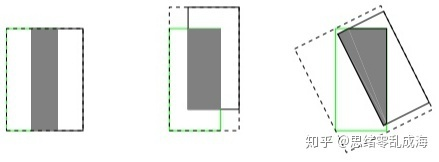

## IOU
公式
$$ IOU = \frac{A∩B}{A∪B} $$

**缺点** 
> 预测框与真实框不相交时，不能反映两个框距离的远近.
> 
> 预测框与真实框无法反映重合度的大小 
> 

## GIOU 
引入了预测框和真实框的最小外接矩形C
$$ GIOU = -1 + \frac{A∪B}{C} $$
> GIOU与IOU采用相同的距离度量损失函数，并且对尺度不敏感
> GIOU<=IOU,而0<=IOU<=1,-1<=GIOU<=1
> GIOU不仅关注重叠区域，还关注其他非重合的区域，更好的反映两者的重合度
> 当真实框和预测框完全重合时，IOU=GIOU=1
> 当不完全重合时，不重合度越高，GIOU越趋近于-1
> 不重叠时，引入真实框与预测框的最小外接矩形
**缺点** 
> 当两个框属于包含关系时，会退化成IOU，无法区分相对位置关系。预测框和真实框是包含关系的情况或者处于水平/垂直方向上，GIOU损失几乎已退化为IOU损失，导致收敛较慢

## DIOU
最小化中心点的距离

## CIOU
在DIOU的基础上将纵横比考虑进去
