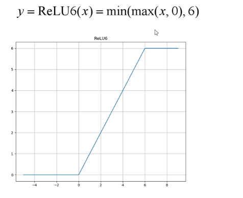
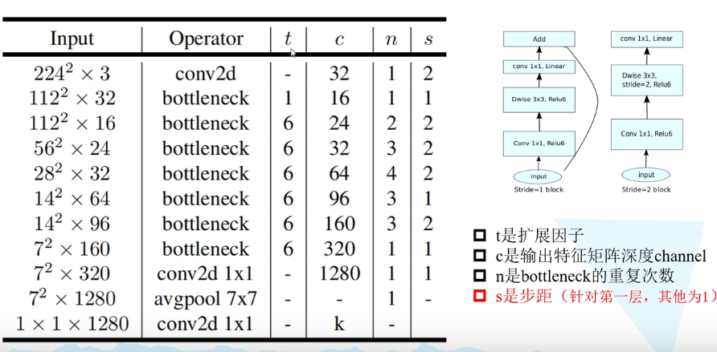
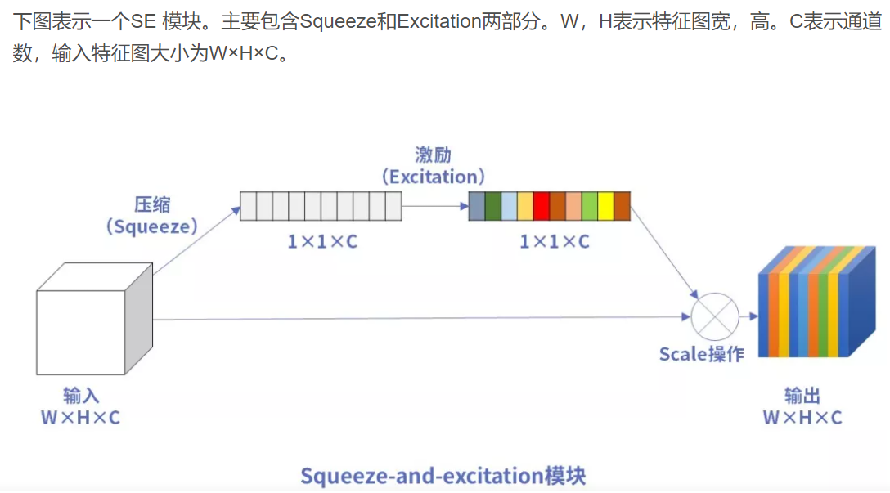
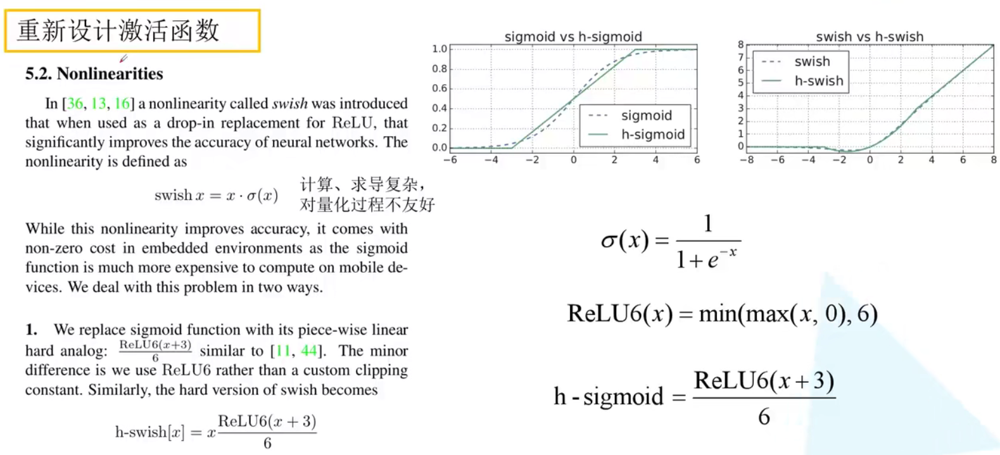

# mobilenet（2017）
传统卷积神经网络，内存需求大、运算量大，语法在移动设备上及嵌入式设备上运行
## mobilenetv1（相比于VGG，准确率低0.9%，参数为1/32）

### Depthwith Convolution，DW卷积（减少运算量和参数数量）
DW卷积：
    卷积核channel为1
    输入特征矩阵channel=卷积核个数=输出特征矩阵的channel
PW卷积：
    卷积核大小为1
### 增加超参数α、β，分别控制卷积核个数和输入图像大小（人为设定，并非学习得到）

**v1版dw卷积核容易大部分参数为0**

## mobilenetv2(准确率提高，模型更小)

### 倒残差结构
先升维，再降维

### 使用relu6激活函数

### liner bottomneck
Relu函数对低维特征  信息造成较大损失

## mobilenetv3
### 更新了block
加入了SE模块（注意力机制）

更新了激活函数

### 使用NAS搜索参数
### 重新设计耗时层结构
减少了第一个卷积核的卷积核个数
精简Last Stage