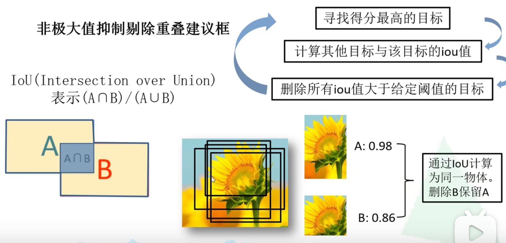
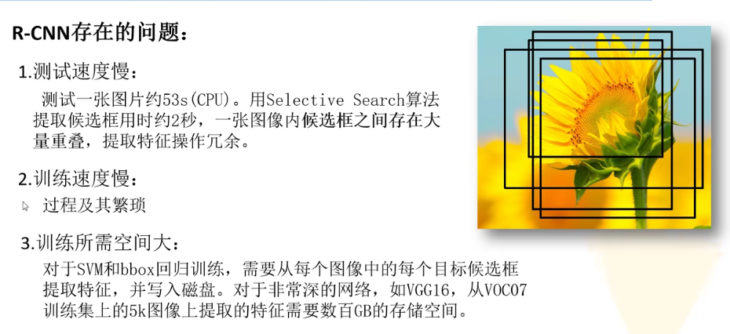
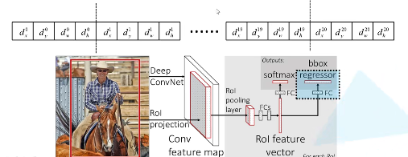
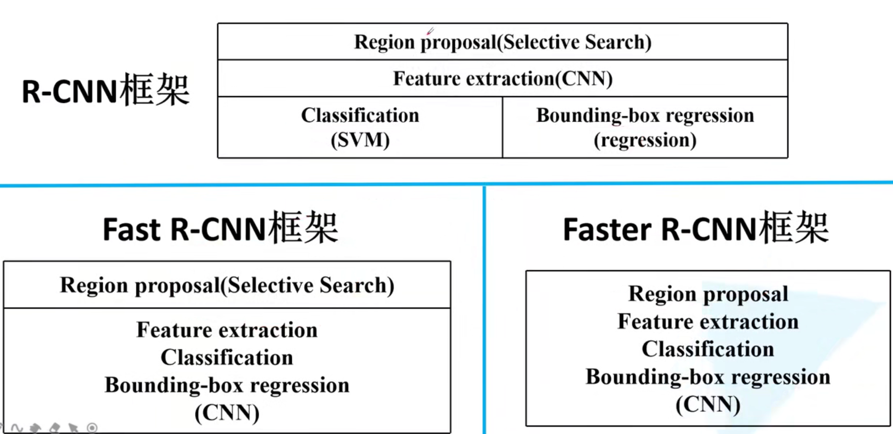

# RCNN（2014）
### **steps**
    1.每一张图片生成1k-2k个候选区域(使用selective search 方法)。
    2.对每个候选区域，使用深度网络提取特征。
    3.特征送入每一类的SVM分类器中，判断是否属于该类。
    4.使用回归器修正候选框位置。

# Fast R-CNN
### **step**
    1.一张图像生成1k-2k个候选框
    2.将图像输入到网络获取到图像特征，将SS算法得到的候选框投影到特征图获得相应的特征举证。
    3.将每个特征矩阵通过ROI pooling层缩放得到7*7大小的特征图，接着将特征图展平，通过一系列全连接层得到预测结果。

### 分类器
输出N+1个类别的概率（N为检测目标的种类，1为背景）
输出对应N+1个类别的候选框回归参数（dx，dy，dw，dh）共（N+1）*4各节点
   

### 损失函数
分类损失+边界框回归损失，（log损失+smooothL1损失）
[损失函数详解](https://blog.csdn.net/weixin_41940752/article/details/93159710)

# Faster R-CNN
### RPN + Fast R-CNN
### **step**
    1.将图像输入网络得到相应的特征图。
    2.使用RPN结构生成候选框，将RPN生成的候选框投影到特征图上获取相应的特征举证
    3.将每个特征举证通过ROI pooling层缩放到7*7大小的特征图，接着将特征图展平通过全连接层得到预测结果。

