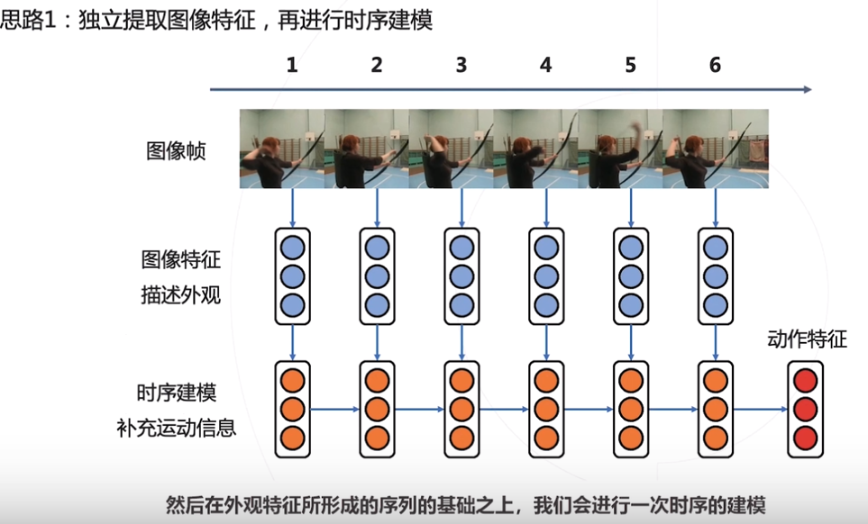

what 行为识别，when+what  时序动作检测， what+when+where 时空动作检测 

## 思路1

## 思路2

## 思路3

+ 光流
  

# 双流网络 
一个用于捕捉外观整体情况，另一个分支用于捕捉运动和变化
 

# 时序分段网络（TSN）： 
 将长视频分段，每个段落选取其中一个瞬间，送进双流网络进行外观和动作的特征提取，分别进行类别的判断，把每个时间段上的判断融合在一起形成最终的判断。
 

# 3d卷积网络
> 2014，C3D 参数增加，训练难度大，缺少数据集。
> 2017，S3D 基于inception模型，采用膨胀卷积得到。
> 混合2d和3d卷积
> 分解3d卷积核
> R(2+1)D
> 减少通道关联

# slowfast 
视频整体外观变换比较缓慢和稳定的，动作的变换高速，采用不同频率对外观和动作进行采样。

# 弱监督学习
视频标注成本比较高